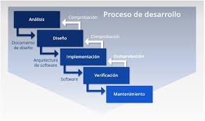

# **Modelo en cascada**

El modelo en cascada es una metodología de desarrollo de software secuencial y lineal, donde el proceso fluye como una "cascada" a través de fases claramente definidas. Cada fase depende completamente de la finalización de la anterior.

> Fue uno de los primeros modelos sistemáticos para gestionar el desarrollo de software y se popularizó en la década de 1970.

## Etapas del modelo en cascada 

#### 1. Recolección de Requerimientos
- Se documentan todas las necesidades del cliente.
- El producto aún no se construye, solo se analizan requisitos funcionales y no funcionales.
#### 2. Diseño del Sistema
- Diseño arquitectónico general.
- Estructura de base de datos.
- Diagrama de clases, flujos, interfaces.
- En JavaScript, aquí podrías decidir si usarás React, Vue, Node.js, Express, etc.
#### 3. Implementación
- Se codifica el sistema completo en base al diseño.
- En este punto, los desarrolladores ya no modifican requerimientos.
- Ejemplo: construir toda la interfaz con HTML/CSS/JS según un mockup aprobado.
#### 4. Pruebas (Testing)
- Pruebas unitarias, integración y aceptación.
- Se revisa que el sistema cumpla los requerimientos definidos inicialmente.
- En un proyecto JS: podrías usar Jest o Cypress aquí.
#### 5. Despliegue
- El producto terminado se entrega al cliente o se pone en producción.
#### 6. Mantenimiento
- Corrección de errores, actualizaciones menores.
- No se contemplan grandes cambios o nuevas funcionalidades.

## Características Clave

| Característica               | Detalle                                                                       |
| ---------------------------- | ----------------------------------------------------------------------------- |
| Secuencial                   | Las fases no se solapan. Una debe terminar antes de pasar a la siguiente.     |
| Documentación intensa        | Cada fase está bien documentada y revisada antes de avanzar.                  |
| Planificación inicial fuerte | Todo debe estar planeado desde el principio. Cambiar algo después es costoso. |

## Ventajas del Modelo en Cascada

* Claridad y estructura.  
* Fácil de gestionar en proyectos pequeños y bien definidos.  
* Ideal cuando los requisitos no van a cambiar.  
* Útil en sistemas regulados (gobierno, aviación, medicina, etc.).  
* Buena trazabilidad de documentación.

## Desventajas

* No permite flexibilidad.  
* Difícil de adaptar a cambios de requerimientos.  
* El cliente no ve resultados hasta el final.  
* Puede haber errores detectados demasiado tarde.  
* No se adapta bien al desarrollo web moderno.

## Ejemplo aplicado (Proyecto JavaScript)

Supongamos que quieres crear un sitio web para mostrar un catálogo de películas. Veamos cómo aplicaría el modelo en cascada:

| Fase           | Actividad                                                                                 |
| -------------- | ----------------------------------------------------------------------------------------- |
| Requerimientos | Recolectar la necesidad: listar películas, buscador, detalle de cada película.            |
| Diseño         | Diseñar el wireframe en Figma, decidir usar React para el frontend y Express para la API. |
| Implementación | Crear todos los componentes, containers, rutas, backend, base de datos.                   |
| Pruebas        | Usar Jest para testear funciones y Cypress para testear el flujo completo.                |
| Despliegue     | Subir el frontend a Vercel y backend a Render o Railway.                                  |
| Mantenimiento  | Arreglar errores de producción si los usuarios reportan algo.                             |

## Cuándo usar Waterfall

| Escenario Ideal                             | ¿Aplicable? |
| ------------------------------------------- | ----------- |
| Proyectos con requisitos muy estables       | Sí          |
| Equipos pequeños y altamente organizados    | Sí          |
| Proyectos regulatorios o con auditoría      | Sí          |
| Aplicaciones JavaScript para startups       | No          |
| Sistemas donde el usuario cambia de opinión | No          |

## Buenas prácticas si decides usar Waterfall

- Define todos los requisitos con lujo de detalle.
- Asegúrate de que el cliente los apruebe.
- Documenta todo desde el principio.
- Usa herramientas de diagrama (Lucidchart, Draw.io).
- Establece revisiones formales entre fases.