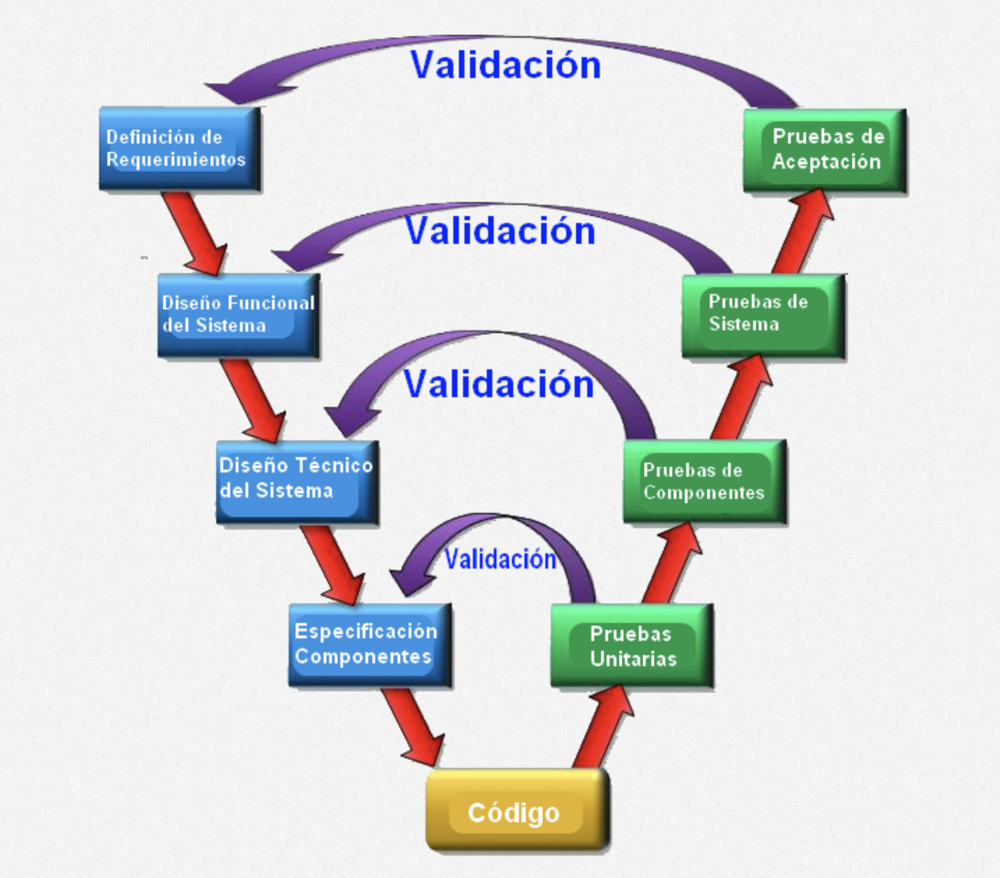

# **Modelo en V**

El Modelo en V (V-Model) es una evolución del modelo en cascada que integra explícitamente la verificación y validación del sistema en cada fase del desarrollo. Su nombre proviene de su forma visual, que representa dos ramas en forma de “V”:
- La rama izquierda se refiere a las actividades de definición y diseño.
- La rama derecha representa las actividades de prueba y validación, que se relacionan directamente con las fases correspondientes del lado izquierdo.
Su enfoque central es la correspondencia directa entre cada fase de desarrollo y su fase de prueba correspondiente.


## Fases del modelo en V



```bash
A[1. Requerimientos del sistema] --> B[2. Requerimientos del software]
B --> C[3. Diseño arquitectónico]
C --> D[4. Diseño detallado]
D --> E[5. Codificación]
E --> F[6. Pruebas unitarias]
F --> G[7. Pruebas de integración]
G --> H[8. Pruebas del sistema]
H --> I[9. Pruebas de aceptación]
```


## Relación entre etapas

| Desarrollo (Izquierda de la V) | Validación (Derecha de la V) |
| ------------------------------ | ---------------------------- |
| Requerimientos del sistema     | Pruebas de aceptación        |
| Requerimientos del software    | Pruebas del sistema          |
| Diseño arquitectónico          | Pruebas de integración       |
| Diseño detallado               | Pruebas unitarias            |
| Codificación                   | N/A (centro de la V)         |


## Características Clave

| Característica                 | Descripción                                                   |
| ------------------------------ | ------------------------------------------------------------- |
| Modelo secuencial              | Las fases siguen un orden rígido y bien definido.             |
| Énfasis en pruebas             | Cada fase de desarrollo tiene su contraparte de verificación. |
| Alta trazabilidad              | Se puede rastrear cada requisito hasta su validación final.   |
| Documentación exhaustiva       | Similar al modelo en cascada.                                 |
| No permite iteraciones rápidas | Cambiar algo implica re-hacer múltiples fases.                |


## Ventajas

* Mejora la calidad del software gracias a su enfoque en pruebas.  
* Asegura una validación temprana de requisitos.  
* Facilita la trazabilidad de errores.  
* Ideal para proyectos críticos y regulados.  
* Compatible con herramientas formales de QA.


## Desventajas

* Poco flexible frente a cambios.  
* Difícil de aplicar en proyectos con requisitos cambiantes.  
* No se adapta bien a productos exploratorios o iterativos.  
* El usuario ve el producto muy tarde.  
* Alto costo de mantenimiento si algo cambia después de codificar.


## Ejemplo aplicado (Proyecto JavaScript)

**Caso**: Desarrollo de un sistema de gestión de tareas con Node.js + React.

|Fase|Actividad en el proyecto|
|---|---|
|Requerimientos del sistema|El cliente necesita una app para tareas personales y trabajo.|
|Requerimientos del software|Especificaciones técnicas: crear, editar, eliminar, ver tareas.|
|Diseño arquitectónico|División en frontend (React) y backend (Node.js + Express).|
|Diseño detallado|Componentes, rutas, modelos, endpoints API.|
|Codificación|Programación de componentes, endpoints, lógica.|
|Pruebas unitarias|Testear componentes y funciones con Jest.|
|Pruebas de integración|Verificar que frontend y backend trabajen juntos (Cypress, Supertest).|
|Pruebas del sistema|Validar el flujo completo (login, tareas, filtros).|
|Pruebas de aceptación|Cliente prueba el sistema en entorno staging.|


## Comparación con el Modelo en Cascada

| Aspecto                    | Cascada                      | V-Model                              |
| -------------------------- | ---------------------------- | ------------------------------------ |
| Validación                 | Al final del proceso         | En cada fase                         |
| Relación prueba-desarrollo | Implícita                    | Explícita                            |
| Cambios en requisitos      | Costosos                     | Igualmente costosos                  |
| Documentación              | Extensa                      | Muy extensa                          |
| Adecuado para              | Proyectos simples o cerrados | Proyectos críticos o de alta calidad |


## ¿Cuándo usar el Modelo en V?

| Situación                                   | ¿Aplicable? |
| ------------------------------------------- | ----------- |
| Requisitos bien definidos y estables        | Sí          |
| Proyectos críticos (salud, banca, gobierno) | Sí          |
| Equipos con testers dedicados               | Sí          |
| Startups o MVPs con cambios constantes      | No          |
| Aplicaciones frontend en evolución continua | No          |


## Mejores prácticas

- Documenta claramente los requerimientos desde el inicio.
- Usa herramientas de pruebas desde la fase de diseño (Test First).
- Relaciona cada prueba con un requerimiento funcional.
- Revisa la cobertura de pruebas como indicador de calidad.
- Usa herramientas como:
    - **Jest** para pruebas unitarias.
    - **Supertest** para pruebas de API.
    - **Cypress** para pruebas de sistema.
    - **Postman** para validaciones manuales.


