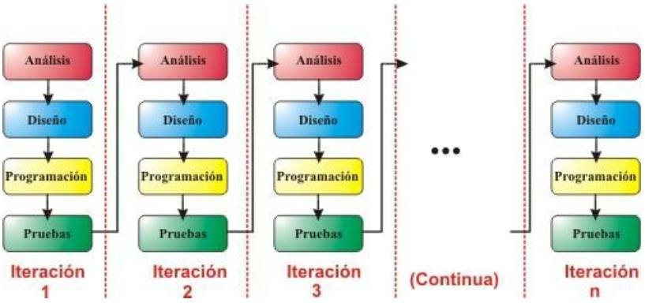

# **Modelo incremental**

El modelo incremental es una metodología de desarrollo de software basada en la construcción del sistema por partes o “incrementos”. Cada incremento añade funcionalidades al producto, partiendo de una versión mínima funcional (core system) que se mejora progresivamente.

A diferencia del modelo en cascada o en V, en el modelo incremental sí se entregan versiones parciales del software que son completamente funcionales.


## ¿Cómo funciona?

El sistema completo se divide en módulos o funciones independientes. Se desarrollan de forma iterativa, permitiendo que cada incremento:
- Sea planificado, diseñado, implementado y probado.
- Dependa y se integre con los incrementos anteriores.
- Aumente el valor entregado al cliente en cada etapa.


## Fases del modelo incremental 



```bash
A[Planificación del incremento] --> B[Diseño del módulo]
B --> C[Codificación]
C --> D[Pruebas]
D --> E[Integración con versión previa]
E --> F[Entrega parcial]
```
Este ciclo se repite tantas veces como módulos existan.


## Características del Modelo Incremental

|Característica|Descripción|
|---|---|
|**Iterativo**|Se desarrolla el software en múltiples ciclos.|
|**Funcionalidad creciente**|Cada incremento añade valor y funciones nuevas.|
|**Entrega parcial continua**|El cliente puede usar partes del sistema antes de que esté completo.|
|**Flexibilidad**|Permite adaptar nuevos requisitos entre incrementos.|
|**Menor riesgo**|Los errores se detectan antes, ya que se trabaja en porciones más pequeñas.|


## Ventajas del Modelo Incremental

* Primeras entregas tempranas.  
* Fácil de integrar feedback del cliente.  
* Mejor gestión del riesgo.  
* Costos de fallos reducidos.  
* Cada módulo puede desarrollarse en paralelo (ideal para equipos grandes).  
* Compatible con pruebas automatizadas desde el inicio.


## Desventajas

* Requiere planificación modular previa.  
* Mal diseño inicial puede dificultar integración.  
* Cada incremento necesita pruebas completas.  
* Gestión de versiones e integración puede volverse compleja sin buenas prácticas.


## Ejemplo aplicado (Proyecto JavaScript)

**Caso**: Aplicación web de recetas de cocina con React y Node.js.

|Incremento|Funcionalidad desarrollada|Herramientas JS|
|---|---|---|
|1|Registro e inicio de sesión|React, Node.js, MongoDB|
|2|Ver listado de recetas públicas|React, Axios, REST API|
|3|Agregar receta con imagen|Multer (Node), Cloudinary|
|4|Sistema de likes y comentarios|MongoDB relaciones|
|5|Panel de administración|Dashboard con filtros y estadísticas|

Después de cada incremento:
- Se hace testing con Jest o Cypress.
- Se realiza integración con los incrementos anteriores.
- Se puede hacer deploy parcial (ej. Vercel + API actualizada).


## Comparación con otros modelos

| Modelo      | Entregas parciales | Adaptación a cambios | Requiere diseño completo |
| ----------- | ------------------ | -------------------- | ------------------------ |
| Cascada     | No                 | No                   | Sí                       |
| V-Model     | No                 | No                   | Sí                       |
| Incremental | Sí                 | Sí                   | No (modular sí)          |


## Cuándo usar el Modelo Incremental

| Escenario                                   | ¿Aplicable?                       |
| ------------------------------------------- | --------------------------------- |
| Proyecto con funcionalidades bien separadas | Sí                                |
| Cliente necesita entregas rápidas           | Sí                                |
| El equipo trabaja en módulos distintos      | Sí                                |
| Requisitos poco claros o en evolución       | Sí                                |
| Proyecto pequeño y simple                   | Puede no ser necesario            |
| Aplicación crítica con procesos regulados   | No recomendable sin plan completo |


## Buenas prácticas en JavaScript

- Usar Componentes independientes en React desde el principio.
- Arquitectura modular en Node.js (por rutas o servicios).
- Testing por módulo desde el inicio.
- Control de versiones por rama (por incremento).
- CI/CD por feature/incremento (GitHub Actions).
