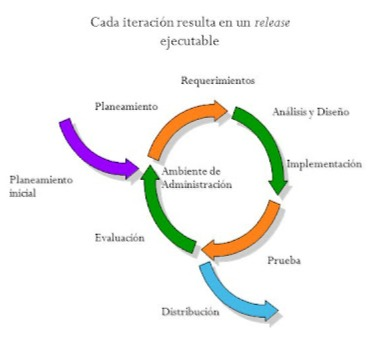

# **Desarrollo iterativo**

El desarrollo iterativo es un enfoque de ingeniería de software en el que el sistema se construye paso a paso, a través de repetidas iteraciones, permitiendo mejorar continuamente el producto en base a retroalimentación temprana y frecuente.

A diferencia del modelo en cascada, donde todo debe planearse al inicio, el enfoque iterativo admite y abraza la evolución del producto durante su desarrollo.
Se construye un sistema básico, se prueba, se evalúa y luego se mejora en ciclos.


## Iteración vs Incremento

Aunque se parecen, no son lo mismo:

| Concepto       | Definición                                                            |
| -------------- | --------------------------------------------------------------------- |
| **Incremento** | Añadir nuevas funcionalidades de forma modular.                       |
| **Iteración**  | Repetir un ciclo completo de desarrollo para **refinar** lo ya hecho. |

En muchas metodologías modernas (como Scrum), los incrementos se construyen iterativamente.


## Fases de una iteración



```bash
A[1. Planificación de la iteración] --> B[2. Análisis de requisitos]
B --> C[3. Diseño]
C --> D[4. Implementación]
D --> E[5. Pruebas]
E --> F[6. Evaluación y retroalimentación]
F --> A
```
Cada iteración:
- Tiene una duración fija (por ejemplo, 1 o 2 semanas).
- Entrega una versión funcional, aunque incompleta del sistema.
- Permite ajustar requisitos para la siguiente vuelta.


## Características del Desarrollo Iterativo

| Característica                 | Detalle                                                     |
| ------------------------------ | ----------------------------------------------------------- |
| **Ciclos repetidos**           | El sistema se desarrolla a través de múltiples iteraciones. |
| **Retroalimentación temprana** | Se valida el avance en cada ciclo, no al final.             |
| **Diseño evolutivo**           | El diseño puede modificarse entre iteraciones.              |
| **Riesgo controlado**          | Los errores se detectan más temprano.                       |
| **Adaptabilidad**              | Se ajusta a cambios de requerimientos fácilmente.           |


## Ventajas

* Entregas tempranas y frecuentes.  
* Reducción de riesgos y errores.  
* Mayor participación del cliente.  
* Flexibilidad frente a cambios.  
* Enfoque en calidad progresiva.  
* Ideal para proyectos JavaScript con frontend dinámico.


## Desventajas

* Requiere compromiso del cliente durante todo el proceso.  
* Puede haber sobrecostos si se hacen muchas iteraciones mal gestionadas.  
* Documentación y diseño pueden quedar rezagados si no se cuidan.  
* Requiere equipo disciplinado y herramientas de control.


## Ejemplo aplicado (Proyecto JavaScript)

**Caso**: Aplicación de agenda personal en React + Express.

| Iteración | Objetivo                     | Actividades                                 |
| --------- | ---------------------------- | ------------------------------------------- |
| 1         | Módulo de login y registro   | Diseño básico de UI, autenticación, pruebas |
| 2         | Agregar tareas               | CRUD de tareas, conexión API, validaciones  |
| 3         | Categorías y etiquetas       | Relación de tareas con categorías, filtros  |
| 4         | Función de recordatorios     | Envío de notificaciones, pruebas e2e        |
| 5         | Ajustes visuales y mejora UX | Mejoras UI, accesibilidad, performance      |

En cada iteración se recolecta feedback de los usuarios, se corrigen errores y se ajusta el plan de desarrollo.


## Relación con metodologías modernas

El desarrollo iterativo es la base conceptual de metodologías ágiles como:
- **Scrum**: Iteraciones llamadas _sprints_, con entregas incrementales.
- **Kanban**: Flujo continuo que permite ciclos iterativos implícitos.
- **XP**: Fomenta iteración continua con retroalimentación técnica (TDD, pair programming).
- **Lean**: Entregas rápidas y continuas para reducir desperdicios.


## Comparación con modelos anteriores

| Modelo      | Cambios durante desarrollo | Entregas parciales | Feedback continuo |
| ----------- | -------------------------- | ------------------ | ----------------- |
| Cascada     | No                         | No                 | No                |
| V-Model     | No                         | No                 | No                |
| Incremental | Sí (por módulo)            | Sí                 | Limitado          |
| Iterativo   | Sí (por ciclo)             | Sí                 | Sí                |


## Aplicación en un proyecto real

Supongamos que creas un portafolio web con React:
- En la primera iteración entregas una página estática con tu nombre y contacto.
- En la segunda, agregas una galería de proyectos.
- Luego una página de blog. 
- Y finalmente una zona de administración para editar el contenido.

En cada iteración:
- Recibes feedback.
- Evalúas el diseño.
- Corriges errores anteriores.
- Añades mejoras.


## Buenas prácticas para JavaScript

- Usa control de versiones por iteración (ramas `feature/iteracion-x`).
- Automatiza pruebas para cada ciclo (con Jest, Playwright, etc.).
- Documenta lecciones aprendidas por ciclo.
- Involucra al usuario (o cliente) en revisiones frecuentes.
- Evalúa cambios y planifica la siguiente iteración con el equipo.