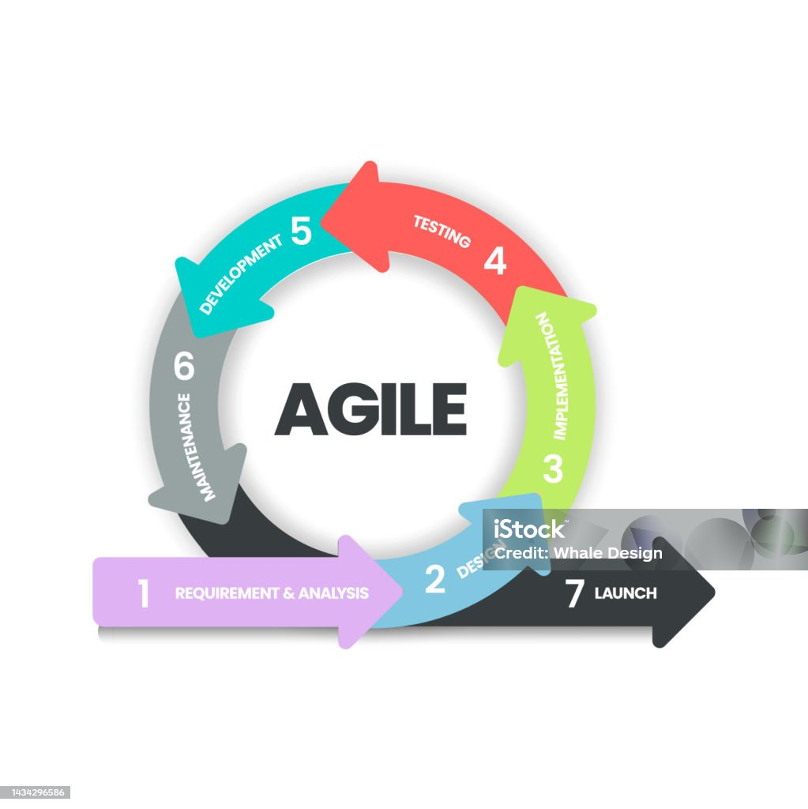

# **Metodología agile**

Agile no es solo una metodología, sino un conjunto de valores, principios y prácticas que busca transformar el desarrollo de software en un proceso más flexible, adaptable y centrado en el cliente. Nació como respuesta a las limitaciones de los modelos tradicionales (como el cascada o V) que eran rígidos, burocráticos y lentos frente a los cambios.

Agile se basa en ciclos cortos de trabajo llamados iteraciones o sprints, donde se entrega software funcional de forma continua, se fomenta la colaboración y se responde rápidamente a los cambios.


## Origen

En 2001, un grupo de 17 expertos en desarrollo de software redactó el famoso Manifiesto Ágil en las montañas de Utah, Estados Unidos. Este manifiesto estableció los 4 valores y 12 principios fundamentales del desarrollo ágil.


## Valores del Manifiesto Ágil

1. Individuos e interacciones sobre procesos y herramientas  
2. Software funcionando sobre documentación exhaustiva  
3. Colaboración con el cliente sobre negociación de contratos  
4. Respuesta ante el cambio sobre seguir un plan


## Los 12 Principios Ágiles

1. Satisfacción del cliente mediante entregas tempranas y continuas.
2. Aceptar cambios, incluso en etapas tardías del desarrollo.
3. Entregar software funcional frecuentemente (de semanas a pocos meses).
4. Trabajo conjunto diario entre desarrolladores y clientes.
5. Construir proyectos en torno a personas motivadas.
6. Comunicación cara a cara como método más eficiente.
7. Software funcional como principal medida de progreso.
8. Desarrollo sostenible, a ritmo constante.
9. Atención continua a la excelencia técnica y al buen diseño.
10. Simplicidad: maximizar el trabajo no realizado.
11. Equipos autoorganizados generan mejores diseños.
12. Reflexionar regularmente sobre cómo ser más efectivos.


## Ciclo de Vida Ágil (Generalizado)



```bash
A[Requerimientos Iniciales] --> B[Planificación del Sprint]
B --> C[Desarrollo]
C --> D[Pruebas]
D --> E[Entrega de Incremento]
E --> F[Revisión y Retrospectiva]
F --> B
```
Este ciclo se repite en iteraciones (típicamente de 1 a 4 semanas) hasta lograr un producto completo.


## Ventajas de Agile

- Alta adaptabilidad al cambio.    
- Mejor comunicación con el cliente.
- Entrega continua de valor.
- Mayor motivación del equipo.
- Mejora constante mediante retrospectivas.
- Reducción de riesgos técnicos y de negocio.


## Roles Clave en Agile (ej. Scrum)

| Rol                  | Descripción                                |
| -------------------- | ------------------------------------------ |
| **Product Owner**    | Define el producto, prioriza requisitos.   |
| **Scrum Master**     | Facilita el proceso, elimina impedimentos. |
| **Development Team** | Desarrolla el producto, autoorganizado.    |


## Ejemplo orientado a JavaScript

Supón que estás desarrollando una SPA (Single Page Application) con React y Node.js para una app de tareas:
- En lugar de especificar todos los requerimientos desde el inicio, el cliente te da una lista priorizada de funcionalidades.
- En el primer sprint, construyes y entregas un módulo funcional de autenticación.
- En el segundo sprint, desarrollas la vista de lista de tareas.
- Cada sprint tiene:
    - Planificación (revisión del backlog)
    - Desarrollo con testing
    - Daily Standups
    - Entrega y demostración
    - Retrospectiva
Este enfoque te permite recibir feedback del cliente desde el inicio y ajustar la dirección del desarrollo sin rehacer todo desde cero.


## Buenas prácticas en Agile

- Mantén sprints cortos y realistas.
- Usa herramientas como Jira, Trello, Notion o GitHub Projects.
- Practica TDD (Test Driven Development).
- Favorece la integración continua (CI/CD).
- Mantén reuniones diarias de máx. 15 minutos (Daily Standup).
- Fomenta la transparencia y colaboración constante.
- No sobrecargues al equipo: deja espacio para la mejora continua.


## Herramientas Ágiles para JS

|Herramienta|Propósito|
|---|---|
|**Jest** / **Vitest**|Testing automatizado|
|**ESLint + Prettier**|Calidad y formato de código|
|**Git + GitHub/GitLab**|Control de versiones y colaboración|
|**CI/CD: GitHub Actions, Vercel, Netlify**|Integración y despliegue continuo|
|**Scrum Boards (Notion, Jira, Trello)**|Gestión ágil visual del progreso|