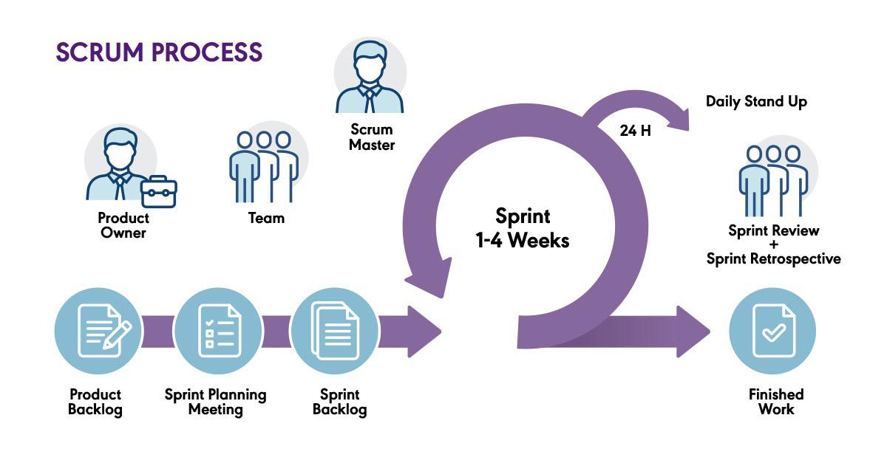

# **Scrum**

Scrum es el marco de trabajo (framework) ágil más popular para el desarrollo de software. Está diseñado para ayudar a los equipos a trabajar de forma colaborativa, iterativa e incremental, entregando valor al cliente en ciclos cortos llamados sprints.

Scrum no prescribe herramientas o técnicas específicas, sino que define una estructura mínima y ligera de roles, eventos y artefactos. Su fortaleza reside en la transparencia, inspección y adaptación constantes.


## ¿Qué es Scrum?

Scrum es un framework ágil basado en:
- Iteraciones cortas llamadas *sprints* (1-4 semanas).
- Un equipo autoorganizado que se compromete a entregar un incremento funcional al final de cada sprint.
- Reuniones estructuradas para planificar, revisar y mejorar continuamente.
- Roles bien definidos y sin jerarquías tradicionales.


## Roles en Scrum

| Rol                    | Descripción                                                                          |
| ---------------------- | ------------------------------------------------------------------------------------ |
| **Product Owner (PO)** | Define y prioriza las funcionalidades del producto (Backlog). Representa al cliente. |
| **Scrum Master (SM)**  | Facilita el proceso Scrum, remueve impedimentos y protege al equipo. No es jefe.     |
| **Development Team**   | Equipo multidisciplinario (devs, testers, diseñadores) que construyen el producto.   |

Todos los roles forman el Scrum Team, que trabaja como una unidad cohesionada.


## Ciclo de vida Scrum (Sprint)



```bash
A[Product Backlog] --> B[Planificación del Sprint]
B --> C[Sprint (1-4 semanas)]
C --> D[Daily Scrum (cada día)]
C --> E[Incremento de Producto]
E --> F[Revisión del Sprint]
F --> G[Retrospectiva del Sprint]
G --> A
```


## Eventos Scrum

#### 1. Sprint
- Duración fija (1-4 semanas).
- Tiempo en el que se construye un incremento funcional del producto.
#### 2. Sprint Planning
- ¿Qué se va a construir? (PO propone objetivos)
- ¿Cómo se va a construir? (Equipo decide tareas técnicas)
- Resultado: Sprint Backlog
#### 3. Daily Scrum
- Reunión diaria de 15 min máx.
- Cada integrante responde:
    - ¿Qué hice ayer?
    - ¿Qué haré hoy?
    - ¿Qué obstáculos tengo?
#### 4. Sprint Review
- Se presenta lo construido al cliente/PO.
- Se obtiene feedback para el próximo sprint.
#### 5. Sprint Retrospective
- El equipo reflexiona sobre el proceso.
- ¿Qué funcionó? ¿Qué no? ¿Qué mejorar?


## Artefactos en Scrum

| Artefacto           | Descripción                                                                    |
| ------------------- | ------------------------------------------------------------------------------ |
| **Product Backlog** | Lista priorizada de todo lo que se desea en el producto. Gestionada por el PO. |
| **Sprint Backlog**  | Subconjunto del Product Backlog que se trabajará en el sprint actual.          |
| **Incremento**      | Resultado funcional del sprint. Debe cumplir la **Definition of Done (DoD)**.  |


## Definition of Done (DoD)

Es una lista de criterios que definen cuándo un elemento del backlog se considera completado. Ejemplos:
- Código probado.
- Documentación incluida.
- Subido al repositorio.
- Revisado por otro desarrollador.


## Ejemplo aplicado a JavaScript

Supongamos que estás construyendo una app web con Next.js y MongoDB. Tu Product Backlog incluye:
1. Registro de usuarios
2. Inicio de sesión con JWT
3. Dashboard con tareas
4. Notificaciones en tiempo real

Para el **Sprint 1**, decides implementar:
- Registro de usuarios (UI + lógica)
- Backend del endpoint `/api/register`
- Validaciones con Zod
- Guardado en MongoDB
- Testing básico con Vitest

Durante el sprint, haces una daily cada día, revisas progreso en GitHub Projects, y al final presentas el registro funcionando.

Después haces una retrospectiva donde mejoras cómo asignan las tareas.


## Ventajas de Scrum

* Adaptación rápida a cambios  
* Entrega continua de valor  
* Colaboración constante con el cliente  
* Mejora continua del equipo  
* Foco en resultados, no en documentación excesiva  
* Alta transparencia y visibilidad del progreso


## Herramientas útiles para Scrum (orientadas a JS)

|Herramienta|Uso|
|---|---|
|**Jira / Trello / Notion**|Gestión del Product y Sprint Backlog|
|**GitHub Projects**|Kanban visual y seguimiento del sprint|
|**Slack / Discord / MS Teams**|Comunicación diaria|
|**Jest / Vitest / Cypress**|Testing|
|**ESLint / Prettier**|Calidad del código|
|**CI/CD (GitHub Actions, Vercel)**|Entregas frecuentes de incrementos|


## Buenas prácticas con Scrum

- Mantén sprints cortos y manejables.
- Respeta las reuniones: NO son burocracia, son inspección y adaptación.
- Asegúrate de tener historias de usuario claras y estimadas.
- Aplica el principio de “trabajo terminado” (Definition of Done).
- Usa retrospectivas para mejorar como equipo, no para culpar.
- El PO debe estar siempre disponible para feedback y decisiones.