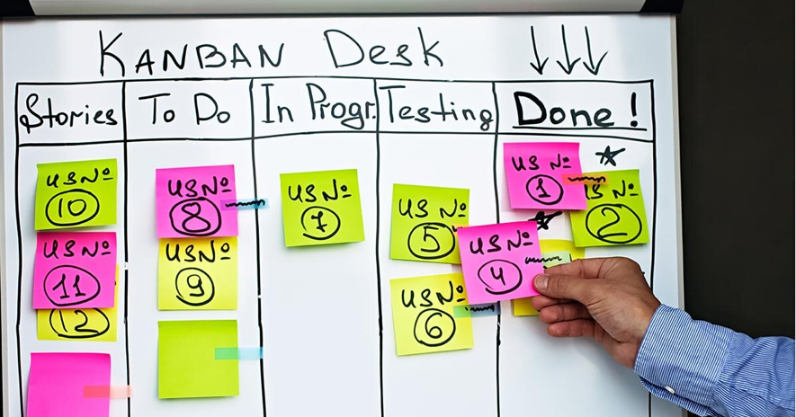

# **Kanban**

**Kanban** es una metodología visual y flexible para la gestión del flujo de trabajo. Nació en las fábricas de Toyota como parte del sistema de producción Just-In-Time, y ha sido adaptada con éxito al desarrollo de software y la gestión ágil de proyectos.

A diferencia de Scrum, Kanban no trabaja en sprints ni roles fijos. En lugar de eso, se enfoca en visualizar el trabajo, limitar el trabajo en curso (WIP) y mejorar continuamente el flujo.


## ¿Qué es Kanban?

Kanban es una metodología ágil basada en:
- Visualización del flujo de trabajo
- Límites del trabajo en curso (WIP limits)
- Entrega continua en lugar de iterativa
- Mejora continua a través de la observación

No impone cambios abruptos, por lo que puede integrarse en equipos que usan otras metodologías (como Scrum o Waterfall).


## Elementos principales 



#### 1. El Tablero Kanban

Es la herramienta principal de Kanban. Se divide en columnas que representan los estados del trabajo, por ejemplo:

```bash
┌────────────┬──────────────┬────────────┬────────────┐
│  To Do     │ In Progress  │ Review     │ Done       │
├────────────┼──────────────┼────────────┼────────────┤
│ Tarea 1    │ Tarea 3      │ Tarea 4    │ Tarea 2    │
│ Tarea 5    │              │            │ Tarea 6    │
└────────────┴──────────────┴────────────┴────────────┘
```
Cada tarjeta representa una tarea o historia de usuario.


#### 2. Límites de trabajo en curso (WIP Limits)

Establecer un número máximo de tareas por columna. Ejemplo:
- Solo puede haber 3 tareas en "In Progress".
- Si se alcanza ese límite, nadie toma una nueva tarea hasta liberar espacio.

Esto evita sobrecarga y fomenta el enfoque en finalizar tareas, no en comenzarlas.


#### 3. Métricas

- **Lead time**: tiempo desde que se inicia una tarea hasta que se completa. 
- **Cycle time**: tiempo que tarda una tarea en avanzar entre columnas.
- **Throughput**: número de tareas completadas en un período.

Estas métricas ayudan a mejorar el rendimiento del equipo con datos reales.


## Aplicación práctica en un proyecto JavaScript

Supongamos que estás desarrollando una app con React y Express.
Puedes usar un tablero Kanban como este:

| To Do              | In Progress (máx 3)  | Review               | Done               |
| ------------------ | -------------------- | -------------------- | ------------------ |
| Crear landing page | Registro de usuarios | Validación de tokens | Conexión a MongoDB |
| Configurar Auth    | Diseño de login form |                      |                    |

- Cuando alguien termina "Registro de usuarios", mueve la tarjeta a Review.    
- Si "In Progress" está lleno, nadie debe comenzar una nueva tarea.
- En lugar de eso, pueden:
    - Ayudar a terminar tareas activas.
    - Revisar pull requests.
    - Mejorar tareas en revisión.


## Comparativa: Scrum vs Kanban

|Característica|Scrum|Kanban|
|---|---|---|
|Tiempo de trabajo|Sprints (iteraciones fijas)|Flujo continuo|
|Roles definidos|Sí (PO, Scrum Master, Team)|No obligatorios|
|Reuniones fijas|Sí (daily, planning, etc.)|Opcionales|
|Tareas por tiempo|Sprint backlog|Flujo de tareas|
|Cambio de tareas|No durante el sprint|Sí, si se respeta WIP|
|Métricas|Velocidad, burndown|Lead time, cycle time|


## Ventajas de Kanban

* Muy visual y fácil de adoptar  
* Flexible ante cambios constantes  
* Mejora continua basada en métricas reales  
* Promueve la finalización de tareas sobre empezar muchas  
* Ideal para mantenimiento o proyectos con flujo irregular


## Herramientas útiles para Kanban

| Herramienta                                  | Uso                                       |
| -------------------------------------------- | ----------------------------------------- |
| **Trello / Jira / Notion / GitHub Projects** | Crear tableros Kanban                     |
| **WIP Charts / Burndown plugins**            | Métricas y análisis                       |
| **CI/CD Integrado**                          | Automatizar despliegues al mover tarjetas |
| **Slack / Discord**                          | Notificaciones de movimiento de tareas    |


## Buenas prácticas

- Define claramente qué significa "hecho" (DoD).
- Comienza con pocos WIP limits y ajusta según capacidad real del equipo.
- Haz reuniones breves semanales para mejorar el proceso.
- Asegúrate de que todos puedan ver y actualizar el tablero.
- Usa etiquetas o colores para categorías: bugs, features, mejoras, etc.


## Cuándo usar Kanban

- Proyectos de mantenimiento o evolutivos.
- Equipos con tareas de flujo constante.
- Equipos que necesitan flexibilidad extrema.
- Para integrar equipos ágiles con equipos tradicionales (devops, QA, soporte).


## Kanban + Scrum = Scrumban

Es posible combinar lo mejor de ambos mundos:
- Usar sprints de Scrum, pero con tableros Kanban.
- Aplicar límites WIP dentro del sprint backlog.
- Usar métricas de flujo para mejorar la estimación de historias.