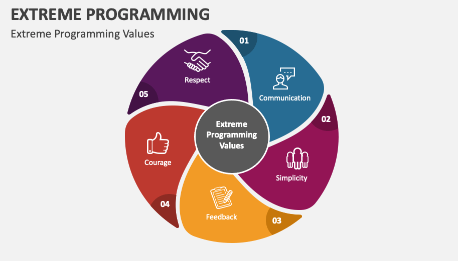

# **Extreme programming (XP)**

Extreme Programming (XP) es una metodología ágil de desarrollo de software que se centra en mejorar la calidad del software y la capacidad de adaptación a los cambios del cliente. XP promueve el trabajo en equipo, la retroalimentación continua, la programación en parejas y ciclos de desarrollo muy cortos. Su enfoque extremo sobre las mejores prácticas busca llevarlas al límite para maximizar sus beneficios.


## ¿Qué es Extreme Programming?

XP fue ideada por Kent Beck a finales de los 90 mientras trabajaba en el sistema de nómina de Chrysler. Nació como respuesta a la necesidad de crear software flexible, de alta calidad y capaz de adaptarse rápidamente a requerimientos cambiantes, especialmente en contextos de alta incertidumbre.

“Extreme” se refiere a aplicar buenas prácticas de ingeniería al máximo nivel: si las pruebas son buenas, XP propone pruebas todo el tiempo; si la revisión de código ayuda, XP propone programación en parejas todo el tiempo.


## Objetivos clave de XP

- Incrementar la productividad del equipo.
- Reducir el riesgo de fallos.
- Adaptarse a los cambios en los requerimientos del cliente.
- Crear software de calidad que funcione desde el primer día.
- Fomentar la comunicación y colaboración continua.


## Principios fundamentales



XP se basa en cinco valores fundamentales:
1. **Comunicación**  
   Promueve la interacción continua entre todos los miembros del equipo.
2. **Simplicidad**  
   Solo se desarrolla lo necesario. Nada más.
3. **Retroalimentación**  
   Se obtienen respuestas rápidamente para poder corregir desviaciones.
4. **Coraje**  
   Fomenta tomar decisiones difíciles y enfrentar problemas.
5. **Respeto**  
   Todos los miembros del equipo son valorados y escuchados.


## Prácticas principales de XP

XP propone un conjunto de prácticas concretas organizadas en 4 grandes categorías:

#### 1. Prácticas de codificación

- **Programación en parejas (Pair Programming)**  
  Dos desarrolladores trabajan juntos en una sola estación de trabajo. Uno “conduce” y el otro revisa. Se intercambian constantemente.
- **Propiedad colectiva del código**  
  Cualquier desarrollador puede modificar cualquier parte del código en cualquier momento.
- **Estándares de codificación**  
  Se definen convenciones que todos deben seguir para facilitar la comprensión del código.
- **Integración continua**  
  Se integra y prueba el código varias veces al día para evitar acumulación de errores.
- **Desarrollo guiado por pruebas (TDD)**  
  Primero se escriben las pruebas, luego el código que las hace pasar.

#### 2. Prácticas de pruebas

- **Pruebas unitarias automatizadas**  
  Todos los componentes deben tener pruebas que se ejecuten constantemente.
- **Pruebas funcionales (Aceptación)**  
  Son definidas por el cliente y aseguran que el software hace lo que se espera.

#### 3. Prácticas de planificación

- **Planificación del juego (Planning Game)**  
  Reuniones periódicas con el cliente para priorizar funcionalidades y decidir qué se implementa en el siguiente ciclo.
- **Historias de usuario**  
  Requisitos escritos en lenguaje natural que reflejan las necesidades del cliente.
- **Estimación simple (story points)**  
  Los desarrolladores estiman el esfuerzo requerido en cada historia de usuario.

#### 4. Prácticas de diseño
- **Diseño simple**  
  Se diseña solo lo necesario para cumplir con los requisitos actuales.
- **Refactorización constante**  
  Se mejora el código sin cambiar su comportamiento externo.


## Ciclo de desarrollo en XP

1. Reunión con el cliente para identificar historias de usuario.
2. Selección de las historias más prioritarias para el ciclo actual.
3. Desarrollo guiado por pruebas.
4. Programación en parejas y refactorización continua.
5. Entrega funcional al final del ciclo (semanal o quincenal).
6. Retroalimentación del cliente → volver a comenzar.


## Diagrama del flujo XP

```bash
[Cliente]
   ↓
[Historias de Usuario]
   ↓
[Planning Game]
   ↓
[Desarrollo Iterativo]
 ↙           ↘
[TDD]    [Pair Programming]
   ↓
[Integración Continua]
   ↓
[Entrega funcional]
   ↓
[Retroalimentación]
```


## Ejemplo en JavaScript: TDD simple

```js
// Test primero (usando Jest o similar)
test('debería sumar dos números', () => {
  expect(sumar(2, 3)).toBe(5);
});

// Código para pasar el test
function sumar(a, b) {
  return a + b;
}
```
Esta pequeña práctica refleja cómo XP impulsa el desarrollo centrado en pruebas.


## Ventajas de XP

- Alta calidad del código.
- Gran flexibilidad ante cambios.
- Excelente colaboración equipo-cliente.
- Automatización de pruebas que previene regresiones.
- Entregas frecuentes de software funcional.


## Desventajas de XP

- No es adecuado para equipos grandes.
- Requiere gran disciplina técnica.
- La programación en parejas puede no adaptarse a todos.
- Es difícil sin un cliente comprometido y disponible.


## Buenas prácticas para usar XP con JavaScript

- Usa herramientas modernas de testing como **Jest**, **Vitest**, **Mocha**.
- Configura un entorno de integración continua con **GitHub Actions** o **GitLab CI/CD**.
- Aplica linters y formateadores: **ESLint**, **Prettier**.
- Haz pair programming con herramientas como **Visual Studio Code Live Share**.
- Mantén historias de usuario claras y actualizadas en herramientas como **Jira**, **Trello** o **Notion**.