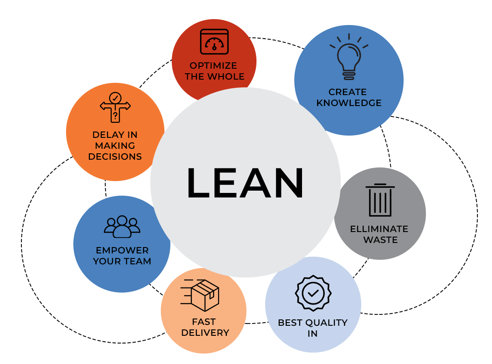

# **Lean software development**

Lean Software Development (LSD) es una metodología ágil derivada de los principios de producción Lean desarrollados originalmente por Toyota. Su objetivo es optimizar la eficiencia del proceso de desarrollo de software eliminando desperdicios (waste), enfocándose en la entrega de valor al cliente y mejorando continuamente.

Si bien LSD puede aplicarse en cualquier lenguaje o plataforma, en este curso la enfocaremos especialmente hacia entornos de desarrollo con JavaScript (por ejemplo: Node.js, React, etc.).

## Principios clave del Lean Software Development

Mary y Tom Poppendieck adaptaron los principios de Lean Manufacturing al desarrollo de software. Estos son los 7 principios fundamentales:

#### 1. Eliminar desperdicio (Eliminate Waste)

En software, el desperdicio se manifiesta como:
- Código no utilizado.
- Documentación innecesaria.
- Funcionalidades no requeridas.
- Esperas innecesarias (por decisiones, aprobaciones, etc.).
- Retrabajo causado por bugs o malentendidos.
- Transferencias de conocimiento deficientes.
- Software que no cumple necesidades reales del usuario.

**Buena práctica en JavaScript**: Mantener el código modular, limpio y enfocado a requisitos mínimos viables.

#### 2. Ampliar el aprendizaje (Amplify Learning)

El software no es una producción en masa repetitiva: es un proceso de descubrimiento.
- Se promueve el feedback constante.
- Uso de prototipos, pruebas A/B, pruebas unitarias y técnicas como TDD (Test Driven Development).
- Se favorecen los ciclos iterativos.

**En JavaScript**: Utiliza herramientas como Vitest, Jest o Mocha para pruebas rápidas y aprendizaje continuo.

#### 3. Tomar decisiones lo más tarde posible (Decide as Late as Possible)

La idea es mantener abiertas las opciones el mayor tiempo posible hasta tener suficiente información para decidir correctamente.
- Favorece diseño flexible y desacoplado.
- Evita comprometerse con tecnologías, herramientas o decisiones prematuramente.

Ejemplo: En lugar de elegir una base de datos relacional al iniciar un proyecto, usar una capa de abstracción (como Prisma o Mongoose) permite cambiar fácilmente si es necesario.

#### 4. Entregar lo más rápido posible (Deliver as Fast as Possible)

Entregar temprano permite:
- Recoger feedback del cliente.
- Adaptarse mejor a cambios.
- Validar suposiciones del negocio.

Prácticas relacionadas:
- CI/CD (Integración y entrega continua).    
- MVPs (Producto Mínimo Viable).
- Feature toggles para despliegue gradual.

#### 5. Empoderar al equipo (Empower the Team)

Equipos autónomos son más eficientes y motivados. Se confía en que los desarrolladores tomen decisiones técnicas.
En un equipo JavaScript:
- Permitir que los desarrolladores escojan herramientas y librerías adecuadas.
- Promover entornos colaborativos (por ejemplo, pair programming o code reviews con GitHub PRs).

#### 6. Construir integridad en el producto (Build Integrity In)

La integridad es tanto externa (experiencia del usuario final) como interna (calidad del código, arquitectura).
Prácticas:
- Arquitecturas limpias (Clean Architecture).
- Estandarización de código (ESLint, Prettier).
- Refactorización constante.

#### 7. Optimizar el todo (Optimize the Whole)

Mejorar una parte del sistema no sirve si el resto es ineficiente. LSD promueve una visión holística del desarrollo.
En entornos JavaScript:
- No basta con tener solo un frontend optimizado. También debe haber backend eficiente, buena arquitectura de APIs, pruebas integradas, etc.

## Ventajas del Lean Software Development

| Ventajas                   | Descripción                                                        |
| -------------------------- | ------------------------------------------------------------------ |
| Mayor enfoque en valor     | El equipo entrega lo que realmente necesita el cliente.            |
| Tiempo de entrega reducido | Se evita el trabajo innecesario y se decide en base a información. |
| Adaptabilidad              | Mejor respuesta al cambio gracias al aprendizaje continuo.         |
| Mejora del feedback        | La entrega temprana y continua lo facilita.                        |
| Mejor cultura de equipo    | Equipos motivados y empoderados toman mejores decisiones.          |

## Retos del Lean Software Development

| Reto                             | Explicación                                                                    |
| -------------------------------- | ------------------------------------------------------------------------------ |
| Requiere alta madurez del equipo | No todos los equipos pueden autogestionarse sin estructura.                    |
| Difícil implementación total     | Algunos entornos organizacionales no permiten eliminar todos los desperdicios. |
| Métricas complejas               | Medir “valor” o “desperdicio” en software es más abstracto.                    |

## Lean y JavaScript: Caso práctico

Imaginemos una startup que quiere construir una app web para compartir recetas:
1. **MVP**: Se construye primero una app simple con React + Node.js donde solo se pueden subir recetas.
2. **Ciclo rápido**: En lugar de planear toda la app durante meses, se lanza el MVP en 2 semanas.
3. **Feedback rápido**: Los usuarios piden poder comentar. El equipo lo implementa en 1 semana.
4. **Desperdicio evitado**: Se habían planeado notificaciones push, pero al ver que los usuarios entran poco, se elimina ese módulo.
5. **Iteración continua**: Cada semana se lanza una mejora, basada en feedback.

## Buenas prácticas para aplicar LSD en JavaScript

- Usa herramientas de integración continua: GitHub Actions, Vercel CI, etc.
- Refactoriza constantemente tu código.
- Mantén tu base de código modular y desacoplada.
- Usa testing automatizado (Jest, Cypress).
- Realiza retrospectivas semanales con tu equipo.
- Involucra a los usuarios reales desde temprano.