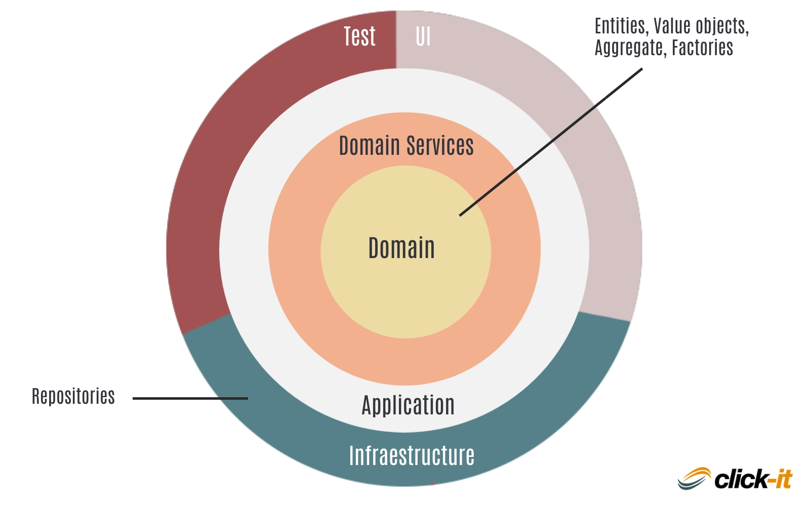

# **Metodología DDD (Domain-Driven Design)**

Domain-Driven Design (DDD) o Diseño guiado por el dominio es una metodología de desarrollo de software que pone al dominio del problema (es decir, el conocimiento del negocio) como el centro de las decisiones técnicas. Fue popularizada por Eric Evans en su libro _Domain-Driven Design: Tackling Complexity in the Heart of Software_ (2004), y desde entonces ha transformado la forma en la que desarrollamos sistemas complejos.


## Objetivo principal de DDD

El propósito de DDD es modelar el software de acuerdo con las reglas, procesos y lenguaje del negocio, de forma que el código represente con precisión la lógica del dominio.
DDD busca una colaboración constante entre los desarrolladores y los expertos del negocio para construir un modelo que sea fiel a la realidad del problema que se quiere resolver.


## Conceptos clave de DDD



#### 1. Dominio

Es el área del conocimiento o actividad alrededor de la cual gira la aplicación. Por ejemplo, en una app bancaria, el dominio es “banca”.


#### 2. Modelo del dominio

Es una representación abstracta del dominio, basada en las reglas de negocio. Esta representación se implementa en el software usando objetos, estructuras y relaciones.


#### 3. Lenguaje ubicuo (Ubiquitous Language)

Es un lenguaje común compartido por desarrolladores y expertos del dominio. Se utiliza en la conversación, documentación y el código.

Ejemplo: si los expertos del negocio hablan de “transferencias interbancarias”, el código debe reflejar esa terminología, en lugar de usar nombres como `MoneyMove` o `BankAction`.


#### 4. Bounded Context (Contexto delimitado)

Es una frontera explícita dentro del dominio donde un modelo específico es válido. Dentro de cada contexto, el lenguaje y las reglas son coherentes, pero pueden diferir entre contextos.

Ejemplo: en una plataforma de e-commerce, puedes tener dos bounded contexts:
- **Catálogo de productos**: enfocado en descripción, categorías, disponibilidad.     
- **Pago**: enfocado en facturación, impuestos, pasarelas de pago.


#### 5. Entidades

Objetos que tienen identidad propia, incluso si sus atributos cambian con el tiempo.

Ejemplo: un `Usuario` tiene un `id` único, aunque cambie su nombre o correo.


#### 6. Value Objects (Objetos de valor)

Objetos sin identidad, definidos solo por sus atributos.

Ejemplo: una clase `Dirección` que contenga calle, número, ciudad y país.


#### 7. Agregados (Aggregates)

Conjunto de entidades y objetos de valor que se comportan como una unidad lógica.

Un `Pedido` puede ser un agregado que contiene `Producto`, `Dirección`, `Cliente`.


#### 8. Servicios de dominio

Lógica de negocio que no encaja naturalmente en una entidad u objeto de valor, pero que pertenece al dominio.

Ejemplo: `CalculadorDeImpuestosService`.


#### 9. Repositorios

Interfaz que proporciona acceso a agregados de forma abstracta, como si fueran colecciones en memoria.

Ejemplo: `RepositorioDeUsuarios.findByEmail()`.


## Estructura típica de un proyecto con DDD

```bash
src/
│
├── dominio/
│   ├── entidades/
│   ├── objetos_de_valor/
│   ├── servicios/
│   └── repositorios/
│
├── aplicacion/
│   ├── casos_de_uso/
│   └── servicios_aplicacion/
│
├── infraestructura/
│   ├── persistencia/
│   ├── APIs/
│   └── servicios_externos/
│
└── interfaz_usuario/
```


## Diagrama de alto nivel

```bash
[ Interfaz de Usuario ]
         ↓
[ Capa de Aplicación ] ← Casos de uso
         ↓
[ Dominio ] ← Entidades, objetos de valor, lógica de negocio
         ↓
[ Infraestructura ] ← Persistencia, APIs, otros sistemas
```


## Ventajas de usar DDD

| Ventaja                           | Descripción                                                                       |
| --------------------------------- | --------------------------------------------------------------------------------- |
| Alineación con el negocio         | El software refleja fielmente el modelo del dominio real.                         |
| Mejora la comunicación            | Uso de un lenguaje compartido entre técnicos y no técnicos.                       |
| Código más expresivo y mantenible | Las estructuras del código representan conceptos reales del negocio.              |
| Enfocado en la lógica             | Se separa la lógica del dominio de otras preocupaciones (UI, base de datos, etc). |


## Desafíos de DDD

| Desafío                       | Descripción                                                                 |
| ----------------------------- | --------------------------------------------------------------------------- |
| Curva de aprendizaje          | Es complejo y requiere tiempo entender todos los conceptos.                 |
| Requiere fuerte colaboración  | No funciona si los desarrolladores no interactúan con expertos del dominio. |
| No es para proyectos pequeños | Puede ser sobrecarga innecesaria si el proyecto no es complejo.             |


## Ejemplo práctico en JavaScript

Imaginemos una app de reservaciones de hotel:

Entidad `Reserva.js` (dominio/entidades)
```js
export class Reserva {
  constructor(id, cliente, habitacion, fechaInicio, fechaFin) {
    this.id = id;
    this.cliente = cliente;
    this.habitacion = habitacion;
    this.fechaInicio = fechaInicio;
    this.fechaFin = fechaFin;
  }

  cancelar() {
    // lógica de cancelación
  }
}
```

Objeto de valor `Periodo.js` (dominio/objetos_de_valor)
```js
export class Periodo {
  constructor(fechaInicio, fechaFin) {
    if (fechaInicio >= fechaFin) throw new Error("Rango inválido");
    this.fechaInicio = fechaInicio;
    this.fechaFin = fechaFin;
  }
}
```

Servicio de dominio `CalculadorPrecioReserva.js`
```js
export class CalculadorPrecioReserva {
  calcular(reserva) {
    const dias = (reserva.fechaFin - reserva.fechaInicio) / (1000 * 60 * 60 * 24);
    return dias * reserva.habitacion.precioPorNoche;
  }
}
```


## Buenas prácticas

1. Adopta el lenguaje ubicuo desde el primer día.
2. Divide tu sistema en bounded contexts que no se solapen.
3. Mantén el dominio limpio, sin acoplarlo con frameworks, bases de datos o interfaces.
4. Apóyate en TDD o BDD para validar el modelo desde la perspectiva del negocio.
5. No sobre-modeles; empieza con lo necesario e itera conforme el dominio lo requiera.


## Cuándo usar DDD

DDD es ideal cuando:
- El sistema tiene una lógica de negocio compleja.
- Hay múltiples roles involucrados en el negocio.
- Se necesita una solución altamente mantenible y extensible.
- Hay una fuerte colaboración con expertos de dominio.


## Cuándo NO usar DDD

Evita DDD cuando:
- Tu sistema es simple o CRUD puro.
- No tienes acceso a expertos del negocio.
- Estás trabajando solo o en un equipo muy pequeño sin necesidad de escalabilidad.