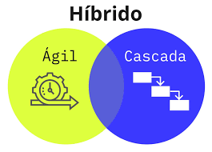

# **Metodologías hibridas**

Las metodologías híbridas combinan aspectos de múltiples metodologías de desarrollo de software para crear un enfoque personalizado que se adapte mejor a las necesidades específicas de un proyecto, equipo u organización. En lugar de seguir un único marco rígido (como Scrum o Waterfall), se eligen elementos útiles de varias metodologías y se integran estratégicamente.

Este enfoque se ha vuelto común en la industria moderna del software, donde los contextos de negocio, equipos y tecnologías son tan diversos que una sola metodología rara vez cubre todas las necesidades.

## ¿Por qué elegir una metodología híbrida?

- **Flexibilidad** para adaptarse a diferentes tipos de proyectos.
- **Escalabilidad** al integrar prácticas ágiles con modelos predictivos.
- **Mayor alineación** con objetivos de negocio específicos.
- **Aprovechamiento de fortalezas** de varios enfoques.
- **Mejor colaboración** entre equipos técnicos y de negocio.

## Ejemplos comunes de combinaciones híbridas

|Metodología Híbrida|Componentes|
|---|---|
|**Agile-Waterfall (Water-Scrum-Fall)**|Scrum para desarrollo, Waterfall para planificación/QA|
|**ScrumBan**|Scrum (sprints) + Kanban (flujo continuo)|
|**Agile + DevOps**|Agile (iteraciones) + DevOps (CI/CD, automatización)|
|**XP + Scrum**|Scrum (roles y sprints) + XP (prácticas de ingeniería)|

## Ejemplo: "Water-Scrum-Fall"

Una de las formas híbridas más adoptadas en grandes organizaciones. Consiste en:
1. **Waterfall** para planificación inicial y documentación.
2. **Scrum** para desarrollo iterativo e incremental.
3. **Waterfall** para pruebas, cumplimiento y despliegue.

Esto permite cumplir con requerimientos legales o de negocio más rígidos, pero mantiene ágil el ciclo de desarrollo.

## Ejemplo aplicado a JavaScript

Imaginemos que una empresa desarrolla una **plataforma de reservas en línea**:

#### Parte 1: Planificación (Waterfall)
- Documentación técnica de requisitos.
- Wireframes y arquitectura general.
- Estimaciones de recursos y presupuesto.

#### Parte 2: Desarrollo (Scrum)
- División del equipo JS en squads:
    - Frontend con React y Tailwind.
    - Backend con Node.js y Express.
- Uso de Sprints de 2 semanas, backlog y retrospectivas.
- Historias de usuario priorizadas en un tablero de Scrum.

#### Parte 3: QA y entrega (Waterfall)
- Validación con normas regulatorias.
- Entregas manuales en etapas planificadas.
- Testing formal por un equipo separado.

## Buenas prácticas en metodologías híbridas

| Práctica               | Descripción                                                     |
| ---------------------- | --------------------------------------------------------------- |
| **Evaluación inicial** | Analiza el entorno del proyecto antes de combinar metodologías. |
| **Revisión continua**  | Adapta el enfoque según resultados en tiempo real.              |
| **Métricas cruzadas**  | Combina KPIs de las metodologías que usas.                      |
| **Comunicación clara** | Documenta el porqué de cada combinación y cómo funcionará.      |
| **Roles definidos**    | Evita solapamientos en prácticas híbridas con límites claros.   |

## Riesgos y desafíos

| Riesgo                         | Cómo mitigarlo                                     |
| ------------------------------ | -------------------------------------------------- |
| Confusión en roles             | Documentar procesos y responsabilidades.           |
| Inconsistencias en entregables | Alinear herramientas y criterios de calidad.       |
| Choque cultural entre equipos  | Fomentar formación y sesiones de integración.      |
| Falta de métricas unificadas   | Establecer un sistema de métricas desde el inicio. |

## ¿Cuándo usar una metodología híbrida?

* Equipos multidisciplinarios o distribuidos.  
* Proyectos con requerimientos regulatorios estrictos.  
* Necesidad de flexibilidad + control.  
* Empresas que están en transición de modelos tradicionales a ágiles.