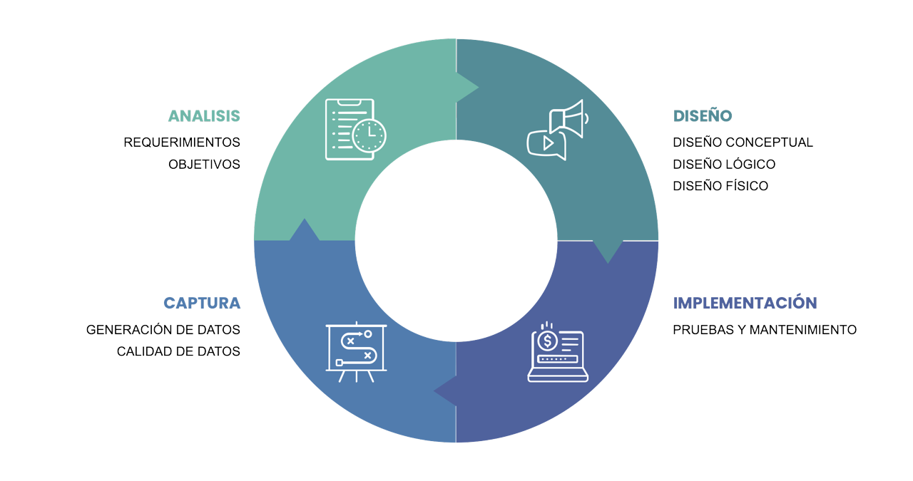

# **Gestión de requerimientos**

La gestión de requerimientos es una disciplina fundamental dentro de cualquier metodología de desarrollo de software. Su objetivo es identificar, documentar, analizar, priorizar, verificar y controlar los cambios en los requerimientos durante el ciclo de vida del software. Una gestión eficiente de requerimientos garantiza que el producto final cumpla con las expectativas del cliente y sea técnicamente viable.


## ¿Qué es un Requerimiento?

Un requerimiento es una necesidad o condición que un sistema debe cumplir. Puede surgir desde el usuario final, el negocio o el entorno técnico del proyecto. En general, se dividen en:
- **Requerimientos funcionales**: describen *qué* debe hacer el sistema (funcionalidad).
- **Requerimientos no funcionales**: describen *cómo* debe comportarse el sistema (rendimiento, seguridad, usabilidad, etc.).


## Etapas del Ciclo de Vida de Requerimientos



```bash
A[Captura de Requerimientos] --> B[Análisis y Priorización]
B --> C[Documentación]
C --> D[Validación y Aprobación]
D --> E[Gestión de Cambios]
```

#### 1. Captura de Requerimientos

Involucra técnicas como:
- Entrevistas con stakeholders
- Workshops colaborativos
- Cuestionarios
- Observación directa
- Análisis de documentos existentes
- Historias de usuario


#### 2. Análisis y Priorización

Se examina la viabilidad, consistencia y completitud de cada requerimiento.
Métodos comunes de priorización:
- MoSCoW (Must have, Should have, Could have, Won't have)
- Valor negocio vs. complejidad técnica
- Modelo Kano


#### 3. Documentación

Una buena documentación es clave. Algunas formas:
- Historias de usuario (Agile)
- Casos de uso (UML)
- Especificaciones de requerimientos (documentos formales)

Ejemplo de caso de uso (resumen):
```bash
Nombre: Registrar nuevo usuario  
Actor: Visitante  
Flujo principal:  
1. El visitante completa el formulario  
2. El sistema valida los datos  
3. El usuario es creado y redirigido al dashboard
```


#### 4. Validación y Aprobación

Se revisan los requerimientos con los stakeholders para asegurar que reflejan fielmente las necesidades del negocio. Técnicas:
- Revisión por pares
- Prototipos
- Walkthroughs
- Reglas de aceptación


#### 5. Gestión de Cambios

Los requerimientos cambian con el tiempo. Se necesita un proceso controlado para gestionar dichos cambios:
- Registro de cambios
- Control de versiones
- Aprobaciones formales


## Buenas Prácticas

- Involucra activamente a los stakeholders desde el principio
- Usa lenguaje claro, sin ambigüedades
- Valida constantemente los requerimientos con el cliente
- Prioriza de forma iterativa
- Mantén trazabilidad entre requerimientos y entregables


## Herramientas para Gestión de Requerimientos

|Herramienta|Características principales|
|---|---|
|Jira|Integración con Agile y Scrum|
|Trello|Sencilla, ideal para Kanban|
|Confluence|Wiki para documentar historias y reglas|
|IBM DOORS|Formal, para grandes organizaciones|
|ReqView / Jama|Análisis de impacto y trazabilidad completa|