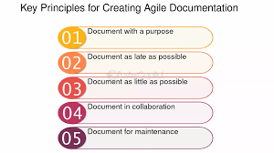

# **Documentación ágil**

La documentación ágil es un enfoque para crear y mantener la documentación dentro de los proyectos de software siguiendo los principios del Manifiesto Ágil. Contrario al paradigma tradicional que exige una documentación exhaustiva desde el inicio, la documentación ágil busca ser útil, ligera, oportuna y suficiente, enfocándose en entregar valor sin obstaculizar el ritmo del desarrollo.

> Mantra clave: "Documenta lo justo y necesario, en el momento adecuado".


## ¿Qué es la Documentación Ágil?



Es el conjunto de artefactos documentales creados durante un proyecto ágil para facilitar la comunicación, colaboración, comprensión y evolución del sistema, sin caer en burocracia innecesaria.
- **Enfocada en el lector**: útil para quienes la usarán.
- **Evolutiva**: cambia con el software.
- **Ligera**: breve y clara, sin redundancia.
- **Colaborativa**: mantenida por todo el equipo, no por un solo rol.


## ¿Qué dice el Manifiesto Ágil?

> “Software funcionando sobre documentación exhaustiva”.

Esto no significa “sin documentación”, sino que:
- La documentación no debe obstaculizar el desarrollo.
- Se prefiere lo mínimo necesario para trabajar eficientemente.
- Debe aportar más valor que el esfuerzo que cuesta generarla.


## Tipos de Documentación en Entornos Ágiles

| Tipo                            | Propósito                                             | ¿Se recomienda en Ágil?   |
| ------------------------------- | ----------------------------------------------------- | ------------------------- |
| Documentación de requerimientos | Historias de usuario, criterios de aceptación         | Sí                        |
| Documentación técnica           | API, estructura de código, decisiones arquitectónicas | Sí, ligera y colaborativa |
| Documentación del usuario       | Manuales, ayuda contextual, tutoriales                | Sí, si aporta valor       |
| Documentación de procesos       | Políticas, flujos de trabajo                          | Solo si es necesaria      |
| Documentación contractual       | Obligatoria por acuerdos legales o regulatorios       | Sí, en lo justo y legal   |


## Herramientas Usadas en Documentación Ágil

| Herramienta       | Uso común                                          |
| ----------------- | -------------------------------------------------- |
| Markdown          | Escribir historias, READMEs, documentación técnica |
| Notion            | Wikis colaborativas, bases de conocimiento         |
| Confluence        | Documentación interna estructurada                 |
| GitHub / GitLab   | Documentación en repositorios, issues y wikis      |
| Swagger / OpenAPI | Documentación de APIs en formato legible           |
| Storybook         | Documentación de componentes UI en React           |


## Buenas Prácticas en Documentación Ágil

1. **Documenta lo necesario**: evita documentos extensos que nadie leerá.    
2. **Hazla parte del flujo**: genera documentación junto con el código.
3. **Automatiza lo repetible**: como documentación de APIs o tests.
4. **Mantenla actualizada**: desactualizada = inútil.
5. **Usa formatos ligeros**: Markdown, diagramas rápidos, código comentado.
6. **Hazla colaborativa**: todos pueden editar y mejorar.

Ejemplo en JavaScript:
```js
/**
 * Filtra productos por categoría.
 * @param {Array} productos - Lista de productos
 * @param {String} categoria - Categoría a filtrar
 * @returns {Array} Productos filtrados
 */
function filtrarPorCategoria(productos, categoria) {
  return productos.filter(p => p.categoria === categoria);
}
```


## Diagramas Ligeros y Visuales

Una práctica común es usar diagramas simples para explicar arquitectura, flujo de usuarios o integración entre servicios. Herramientas recomendadas:
- Mermaid (en Markdown)
- Excalidraw (dibujos a mano)
- PlantUML
- Lucidchart / Draw.io


## Documentación como Código (Docs-as-Code)

Una filosofía que trata la documentación igual que el código:
- Versionada con Git
- Escrita en Markdown/AsciiDoc
- Revisada vía pull requests
- Desplegada automáticamente (ej. Docusaurus, MkDocs)


## Comparativa: Documentación Tradicional vs Ágil

|Aspecto|Tradicional|Ágil|
|---|---|---|
|Volumen|Extenso|Ligero y útil|
|Tiempo de creación|Al inicio del proyecto|Evolutiva y continua|
|Mantenida por|Rol especializado (analista, técnico)|Todo el equipo|
|Prioridad|Alta, incluso sobre funcionalidad|Baja, si no aporta valor|
|Flexibilidad|Rígida|Adaptativa|