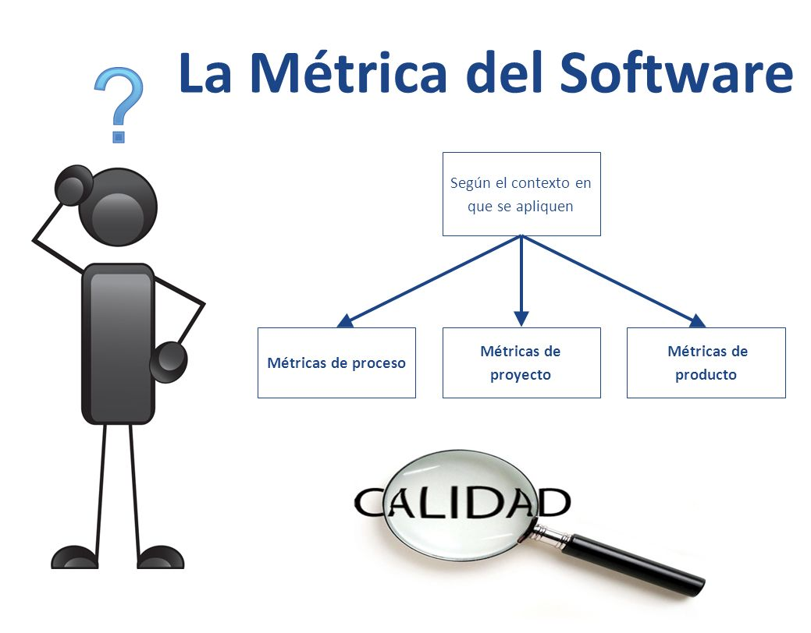

# **Métricas y control de proyectos**

El uso de métricas es una parte fundamental en la gestión de proyectos de software. Las métricas permiten medir, evaluar y controlar diferentes aspectos del desarrollo, desde el rendimiento del equipo hasta la calidad del código. Junto con técnicas de control, permiten detectar desviaciones, tomar decisiones basadas en datos y mantener alineado el proyecto con sus objetivos.


## ¿Por qué son importantes las métricas?

En el desarrollo de software, "lo que no se mide, no se puede mejorar". Las métricas ayudan a:

- Estimar mejor el esfuerzo y tiempo necesarios.
- Predecir retrasos o sobrecargas.
- Evaluar la productividad de equipos.
- Identificar cuellos de botella o malas prácticas.
- Controlar la calidad del producto.
- Tomar decisiones objetivas.


## Tipos de métricas en proyectos de software



Las métricas se agrupan en varias categorías, dependiendo de lo que midan:

#### 1. Métricas de Proceso

Miden el rendimiento del proceso de desarrollo.
- **Velocidad (Velocity)**: cantidad de trabajo completado en un sprint (Scrum).
- **Tasa de defectos**: errores encontrados por unidad de tiempo o versión.
- **Lead Time**: tiempo desde que se solicita una funcionalidad hasta que se entrega.
- **Cycle Time**: tiempo desde que se empieza a trabajar en una tarea hasta que se termina.


#### 2. Métricas de Producto

Evalúan la calidad del producto desarrollado.
- **Complejidad ciclomática**: mide la complejidad del código fuente.
- **Cobertura de pruebas (Test Coverage)**: porcentaje de código cubierto por pruebas.
- **Tasa de fallos por módulo**: errores por componente o funcionalidad.
- **Acoplamiento y cohesión**: mide la interdependencia y cohesión entre clases/módulos.


#### 3. Métricas de Proyecto

Relacionadas con la planificación y ejecución del proyecto.
- **Burndown chart**: gráfico que muestra el trabajo restante versus el tiempo.
- **Cumplimiento de fechas**: tareas entregadas a tiempo vs total planeado.
- **Uso de recursos**: cuántos recursos humanos y técnicos se han utilizado.
- **Presupuesto vs Gasto real**: control financiero del proyecto.


#### 4. Métricas de Equipo

Evalúan aspectos humanos y de colaboración.
- **Satisfacción del equipo**: encuestas periódicas sobre motivación.
- **Rotación del equipo**: cambios o abandonos en el equipo.
- **Participación en tareas**: distribución equitativa del trabajo.


## Herramientas comunes de control

#### Herramientas de seguimiento y métricas:

- **Jira**: ofrece informes automáticos como burndown, velocity, lead/cycle time.
- **GitHub/GitLab**: aporta métricas de commits, PRs, revisiones, issues.
- **SonarQube**: mide calidad del código, cobertura, bugs, duplicaciones.
- **Google Sheets / Excel**: permiten control personalizado de métricas.
- **Trello / Asana**: aunque simples, pueden personalizarse con extensiones.


#### Gráficos comunes:

| Gráfico                           | Descripción                                         |
| --------------------------------- | --------------------------------------------------- |
| **Burndown Chart**                | Muestra trabajo pendiente frente al tiempo.         |
| **Cumulative Flow Diagram (CFD)** | Visualiza el flujo de tareas entre columnas Kanban. |
| **Histogramas de defectos**       | Visualiza la cantidad de errores por versión.       |
| **Dashboards personalizados**     | Combinan múltiples métricas en una vista unificada. |


## Buenas prácticas

- **Mide periódicamente**: no basta con medir una vez. La frecuencia permite detectar tendencias.
- **Define objetivos claros**: cada métrica debe responder a una pregunta útil para el proyecto.
- **Evita la sobre-metricación**: demasiadas métricas distraen. Elige las que aporten valor real.
- **Comparte métricas con el equipo**: promueve la transparencia y mejora continua.
- **Valida la calidad, no solo cantidad**: por ejemplo, muchos commits no significan productividad real.
- **Analiza desviaciones**: si algo se aleja del objetivo, busca la causa raíz.


## Ejemplo en contexto (JavaScript)

Supongamos que estás trabajando en un equipo que desarrolla una aplicación React + Node.js. Usas:
- **Jira** para sprints,
- **GitHub** para repositorio,
- **SonarQube** para calidad de código.

Las métricas que podrías llevar:
```bash
- Velocity: 35 story points por sprint
- Cobertura de tests: 80% en backend (Jest)
- Tasa de bugs en producción: 0.5 por sprint
- Tiempo medio de PR review: 1.5 días
- Complejidad ciclomática promedio: 3.8
```
Estas métricas te permiten ver si estás cumpliendo tiempos, entregando código de calidad y con un equipo comprometido.


## Control del proyecto con métricas

Controlar un proyecto implica:
1. **Establecer una línea base (baseline)** de tiempos, tareas y recursos.
2. **Comparar el avance real vs planificado** con ayuda de métricas.
3. **Detectar desviaciones**.
4. **Tomar acciones correctivas**.
5. **Documentar lecciones aprendidas**.

La combinación de planificación, monitoreo y métricas crea un ciclo de mejora continua.