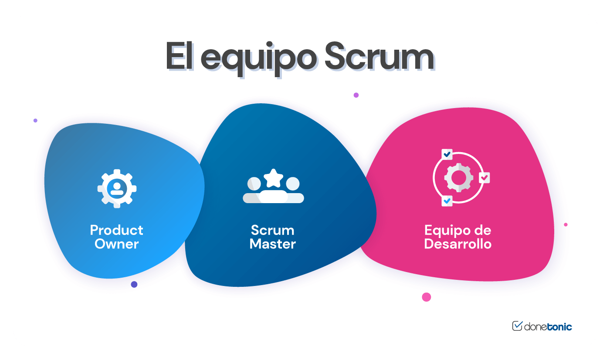

# **Roles en equipos de desarrollo**

En el mundo del desarrollo de software, la colaboración efectiva entre distintos perfiles profesionales es fundamental para alcanzar el éxito. Cada integrante del equipo cumple una función específica que contribuye al ciclo de vida del software, desde la concepción hasta la entrega y mantenimiento.

Comprender los roles dentro de un equipo de desarrollo no solo mejora la eficiencia y la organización, sino que también permite identificar responsabilidades, puntos de contacto y procesos clave durante el desarrollo. Aunque cada metodología tiene variaciones en la asignación de funciones, existen roles comunes que se repiten en la mayoría de los contextos.

## Principales Roles en Equipos de Desarrollo

#### 1. Product Owner (PO)

- Representa al cliente o usuario final.
- Define, prioriza y mantiene el product backlog.
- Se asegura de que el equipo esté trabajando en las funcionalidades correctas.
- Responsable del valor del producto que se desarrolla.

**Ejemplo JS:** En una aplicación SaaS construida en Next.js, el PO define qué módulos necesita el cliente y prioriza qué se desarrolla primero (ej. dashboard, login, integraciones).

#### 2. Scrum Master / Agile Coach

- Facilita la implementación de la metodología Agile (usualmente Scrum). 
- Elimina bloqueos (impedimentos) que afectan al equipo.
- Protege al equipo de interrupciones externas.
- Fomenta la mejora continua.

En equipos sin Scrum formal, este rol puede ser asumido por el **Team Lead**.

#### 3. Desarrollador(a) Frontend

- Encargado del diseño e implementación de interfaces de usuario. 
- Usa tecnologías como HTML, CSS, JavaScript, y frameworks como React, Vue, Angular, etc.
- Trabaja estrechamente con diseñadores UI/UX.

**Ejemplo:** Implementar una vista responsiva en React con Tailwind para un panel de usuario.

#### 4. Desarrollador(a) Backend

- Implementa la lógica del servidor, bases de datos y API. 
- Trabaja con Node.js, Express, bases de datos SQL/NoSQL, autenticación, etc.
- Encargado de la arquitectura, seguridad, escalabilidad y rendimiento del backend.

**Ejemplo:** Crear una API REST con Express para autenticar usuarios y retornar tokens JWT.

#### 5. Full Stack Developer

- Combina habilidades de frontend y backend.
- Ideal para startups o equipos pequeños donde se requiere flexibilidad.
- Suele manejar DevOps básico, bases de datos, API, pruebas y despliegue.

Un desarrollador full-stack JavaScript podría usar Next.js + Node.js + MongoDB, y desplegar en Vercel.

#### 6. UI/UX Designer

- Diseña la experiencia de usuario (UX) y las interfaces visuales (UI).
- Se apoya en herramientas como Figma, Adobe XD, Sketch.
- Define los flujos, wireframes, y guías de estilo.

**Relación con desarrollo:** Entrega prototipos que los desarrolladores frontend implementan.

#### 7. Tester / QA Engineer

- Verifica que el software cumpla con los requisitos funcionales y no funcionales.
- Diseña e implementa casos de prueba manuales y/o automáticos.
- Participa en pruebas de regresión, carga, seguridad, etc.

En JavaScript, pueden usar herramientas como **Jest**, **Cypress** o **Playwright** para pruebas automatizadas.

#### 8. DevOps Engineer

- Automatiza despliegues, CI/CD, gestión de servidores y contenedores (Docker, Kubernetes).
- Colabora con backend y QA.
- Administra entornos (dev, staging, prod).

**Ejemplo:** Crear un pipeline GitHub Actions que testea, construye y despliega una app Node.js.

#### 9. Arquitecto(a) de Software

- Define la estructura técnica del sistema.
- Establece los patrones de diseño, estándares de codificación, arquitectura (monolítica, microservicios).
- Coordina decisiones técnicas complejas.

En un sistema de microservicios JS, el arquitecto puede definir cómo se comunican servicios vía HTTP o mensajería.

#### 10. Project Manager (PM)

- Coordina esfuerzos, plazos, recursos y comunicación con stakeholders.
- No siempre tiene conocimiento técnico profundo.
- Se encarga de la planificación, seguimiento y entrega.

## Roles en Metodologías Ágiles

|Rol Tradicional|Equivalente en Agile|
|---|---|
|Jefe de Proyecto|Scrum Master / PO|
|Analista de Requisitos|PO / Equipo|
|Tester|QA / Developer (en XP, todos prueban)|
|Arquitecto|Team Lead / Arquitecto técnico emergente|

## Buenas Prácticas en la Gestión de Roles

- **Claridad de responsabilidades:** Cada miembro debe entender su rol y el de los demás.
- **Documentación mínima pero útil:** Roles y responsabilidades deben estar documentadas.
- **Evitar silos:** Promover la colaboración entre roles.
- **Transparencia:** Usar tableros de tareas y reuniones para mantener comunicación abierta.
- **Roles adaptativos:** En startups o equipos ágiles, algunos roles pueden combinarse según necesidad.